# Digital Image Process Homework 2019 Fall

## 测试环境安装
要求能够虚拟环境或实体环境能够正确安装opencv-python

```bash
# 安装conda环境
conda create -n digitalImage python=3.7
# 安装依赖
pip install -r requirements.txt
# 激活环境
conda activate digitalImage
```
## Geometry.py 几何变换

功能: 对图像进行旋转, 缩放

使用方法:
```bash
python Geometry.py -f [Image path] -t rotate --theta [angle]
python Geometry.py -f [Image path] -t scale --xscale [scale] --yscale [scale]

# 旋转
python Geometry.py -f ../test_images/camera.tiff -t 'rotate' --theta 45
# 缩放
python Geometry.py -f ../test_images/camera.tiff -t scale --xscale 1.5 --yscale 2
```

### 示例

**旋转图像**
```
python Geometry.py -f ../test_images/camera.tiff -t 'rotate' --theta 45
```
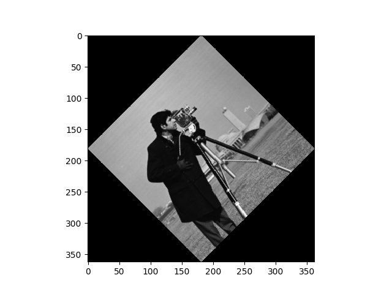

**缩放图像**
```
python Geometry.py -f ../test_images/camera.tiff -t scale --xscale 1.5 --yscale 2
```
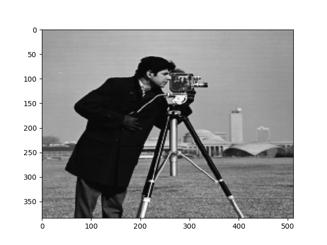

## GrayScaleTranform.py 灰度变换
功能: 图像均衡化, 规定化

使用方法:

**均衡化**

```bash
python GrayScaleTransform.py -t equal -f [Image path]
python GrayScaleTransform.py -t equal -f ../test_images/camera.tiff
```

**规定化**

```bash
python GrayScaleTransform.py -t normal -f [Source Image path] --file_tar [Target Image path]
python GrayScaleTransform.py -t normal -f ../test_images/lax.tiff --file_tar ../test_images/camera.tiff
```
### 示例

**均衡化**
```
python GrayScaleTransform.py -t equal -f ../test_images/camera.tiff
```

原图直方图 vs 均衡化后直方图

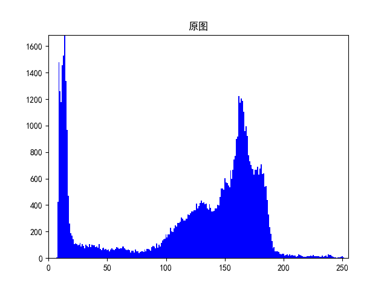


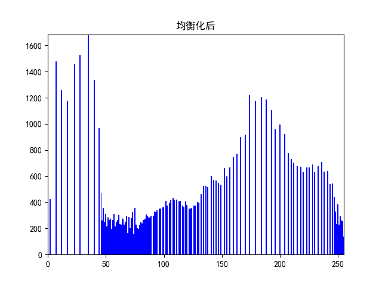

均衡化结果

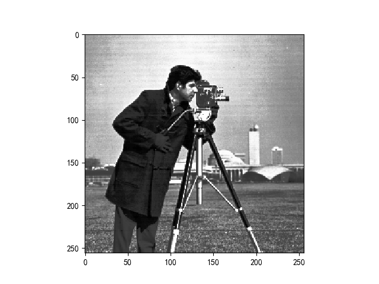


**规定化**
```
python GrayScaleTransform.py -t normal -f ../test_images/lax.tiff --file_tar ../test_images/camera.tiff
```

直方图: 规定化的目标 & 规定化之前 & 规定化之后

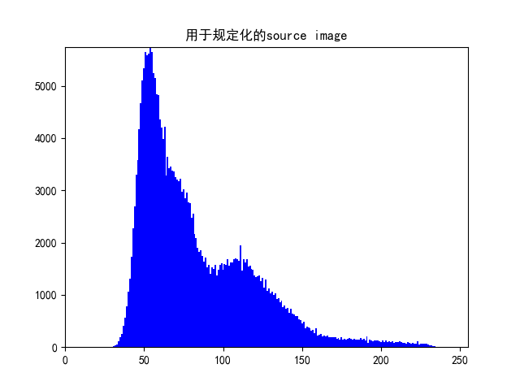

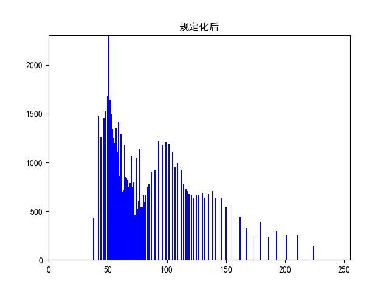

规定化前后图片

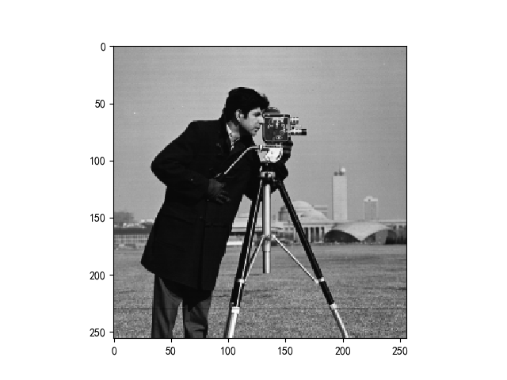
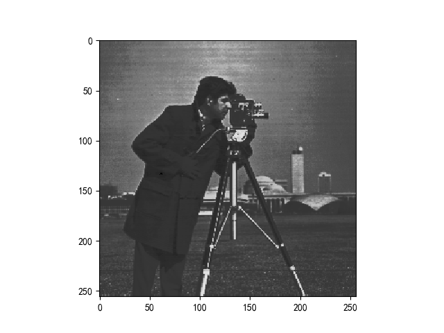

## FourierTransform.py 傅里叶滤波
功能: 对图像在频域进行滤波

使用方法:

```bash
python fourierTransform.py -f [ImagePath] --filter [filterType]
# High Pass
python fourierTransform.py -f ../test_images/camera.tiff --filter simpleHighPass
python fourierTransform.py -f ../test_images/camera.tiff --filter laplacian
# Low Pass
python fourierTransform.py -f ../test_images/camera.tiff --filter simpleLowPass
python fourierTransform.py -f ../test_images/camera.tiff --filter guassian
python fourierTransform.py -f ../test_images/camera.tiff --filter mean
python 
```

### 示例

简单高通滤波器实现
```
python fourierTransform.py -f ../test_images/camera.tiff --filter simpleHighPass
```
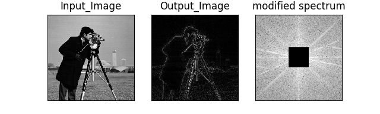

简单低通滤波器实现
```
python fourierTransform.py -f ../test_images/camera.tiff --filter simpleLowPass
```
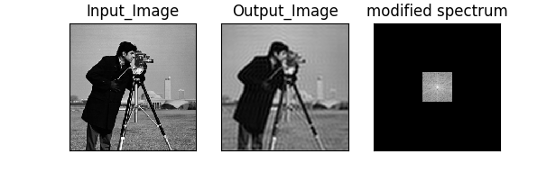

```
python fourierTransform.py -f ../test_images/camera.tiff --filter guassian
```
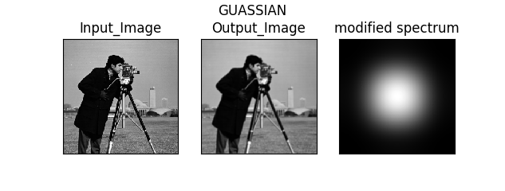

## connectedRegion.py

功能: 对二值化图片进行联通区域标记

使用方法:

```bash
python connectedRegion.py -f [Image Path] -n [neighborhood Size]
python connectedRegion.py -f ../test_images/rice-bw.png -n 4
```

### 示例

```
python connectedRegion.py -f ../test_images/rice-bw.png -n 4
```

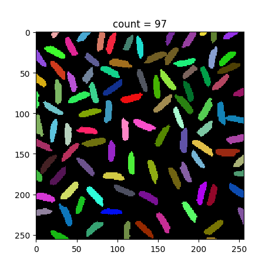


## boundaryTrack.py 边界追踪

功能: 对二值化图像进行多元素边界追踪

使用方法:
```bash
python boundaryTrack.py -f [Image path]
python boundaryTrack.py -f ../test_images/rice-bw.png
```

### 示例

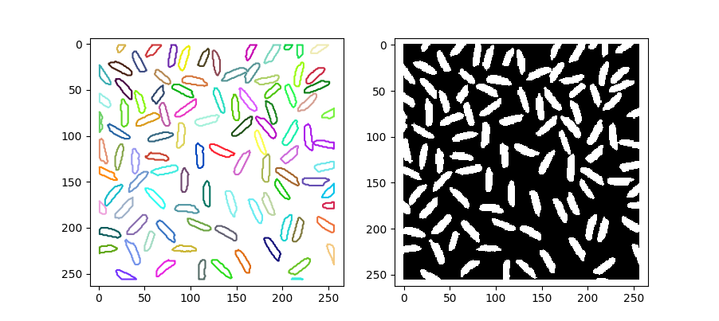

